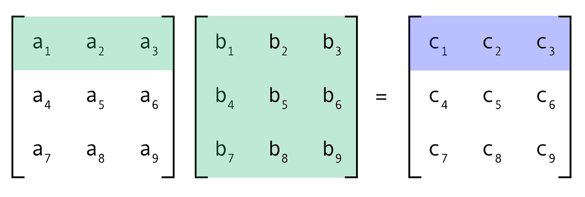

# Matrix Multiplication (Multi-Threading)

## 1. Objectives

* To get familiar with thread programming using the [Pthread library](https://hpc-tutorials.llnl.gov/posix/).
* To better understand processes and threads.

## 2. Overview

Implement a multi-threaded [matrix multiplication](https://www.mathsisfun.com/algebra/matrix-multiplying.html) program.

The input to the program is two matrixes A(x*y) and B(y*z) that are read from corresponding text files. The output is a matrix C(x*z) that is written to an output text file.

A parallelized version of matrix multiplication can be done using one of these three methods:

1. A thread computes the output C matrix i.e. without multi-threading. (A thread per matrix).

2. A thread computes each row in the output C matrix. (A thread per row).

3. A thread computes each element in the output C matrix. (A thread per element).

## 3. Features

* Implement the multi-threaded matrix multiplication using all three methods described above.
* Compare the three implementations according to the following:
    1. Number of threads created.
    2. Execution time taken.

The program do the following:

* The program is executed as: ./matMultp Mat1 Mat2 MatOut, where Mat1 and Mat2 are the names of the text files to read the first and second matrices, respectively, and MatOut is the prefix of the text files names to write the output matrices (each file represents one method). If the user does not enter this information, the default is a.txt and b.txt, for input matrixes A and B, and c for output matrices (of all three methods) C. The following example should clarify inputs/outputs files.

    Arguments

        Example: 
            ./matMultp a b c
        Input files: 
            a.txt 
            b.txt
        Output files: 
            c_per_matrix.txt
            c_per_row.txt
            c_per_element.txt

    No Arguments:

        Example: 
            ./matMultp
        Input files: 
            a.txt 
            b.txt
        Output files: 
            c_per_matrix.txt
            c_per_row.txt
            c_per_element.txt

    Custom Arguments:

        Example: 
            ./matMultp x y z
        Input files: 
            x.txt 
            y.txt
        Output files: 
            z_per_matrix.txt
            z_per_row.txt
            z_per_element.txt

* Read the number of rows and columns of the input matrices. They are written in the first line of the file as ”row=x col=y”. The following is an example of the format on an input file.

        row=3 col=5
        1 2 3 4 5
        6 7 8 9 10
        11 12 13 14 15

* Read the input matrices from their corresponding files. Each row is on a separate line, columns are separated by spaces.
* Use threads to calculate the matrix that results from multiplying the input two matrixes.
* Output the resulting matrices in three files (each file represents one method). The following is an example of the format of the three output files.

    c_per_matrix.txt

        Method: A thread per matrix
        row=2 col=2
        1 2
        3 4

    c_per_row.txt

        Method: A thread per row
        row=2 col=2
        1 2
        3 4

    c_per_element.txt

        Method: A thread per element
        row=2 col=2
        1 2
        3 4

## 4. Memory Management

The code handle memory management and sending arguments to threads functions as following:

* In the case of (A thread per row) it does the following:
  * Leave matrices A, B, and C in the global segment and only pass the row number to the thread function by value.
  * send the struct to the thread function by reference (allocate the struct in the dynamic heap).
  
* In the case of (A thread per element) it does the following:
  * Leave matrices A, B, and C in the global segment, then create a struct that has the row number, and the column number, send this struct to the thread function by reference (allocate the struct in the dynamic heap).
  * create a struct that has A*, B*, C* (pointers to the arrays), the row number, and the column number , then send the struct to the thread function by reference (allocate the struct in the dynamic heap).
* In all cases, we need to free any allocated memory in the dynamic heap at the end of the worker (child) thread, no memory leak should be allowed.
